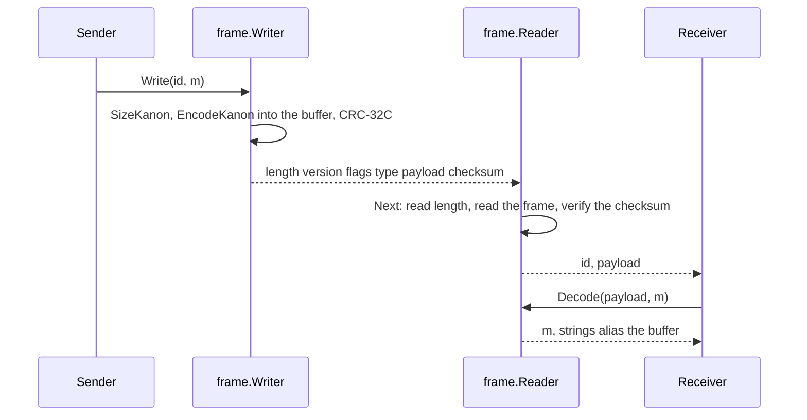

# RFC-0003: Frames for messages on a stream

## Summary

A frame is one kanon message on a byte stream: a length, a format version, flags, a type ID,
the encoding, and an optional CRC-32C. The package `kanon/frame` writes frames to an
`io.Writer` and reads them from an `io.Reader` with one reused buffer, decodes a frame into a
`kanon.Message` without copying, and maps type IDs to constructors through a registry. Servers
of one fleet exchange frames over TCP, TLS or a message bus.

## Motivation

A kanon encoding has no length and no type of its own. Two servers on a stream need both: the
length to know where a message ends, and the type to know which struct decodes it. Without a
shared package, every service writes its own framing, and two services that frame differently
cannot talk. A frame also needs a format version, so that a fleet can change the frame layout
in a rolling upgrade, and an optional checksum for transports that do not verify integrity.

## Detailed design

### The frame

```text
frame    = length version flags type payload [checksum]
length   : uvarint, the number of bytes after itself
version  : 1 byte, value 1
flags    : 1 byte; bit 0 set when checksum is present; other bits must be 0
type     : uvarint, the type ID
payload  : the kanon encoding of the message
checksum : 4 bytes, little-endian, CRC-32C (Castagnoli) over version through payload
```

- A reader must reject a version other than 1, a flags byte with a bit above 0 set, a length
  above its limit, and a checksum mismatch.
- A payload may be empty: a message whose every field is absent is a valid frame.
- Type IDs are assigned by the application as constants and are part of its wire contract. An
  ID is never reused for another type.

### The package

```go
package frame

// Errors of Reader. A stream that ends between frames returns io.EOF, and
// one that ends inside a frame returns an error that wraps
// io.ErrUnexpectedEOF.
var (
	ErrVersion  = errors.New("frame: unsupported version")
	ErrFlags    = errors.New("frame: unknown flag")
	ErrTooLarge = errors.New("frame: longer than the reader's limit")
	ErrChecksum = errors.New("frame: checksum mismatch")
	ErrUnknown  = errors.New("frame: type not registered")
)

// DefaultMaxSize is the frame length a Reader accepts when MaxSize is 0.
const DefaultMaxSize = 16 << 20

// Registry maps type IDs to constructors. It is safe for concurrent reads
// after registration.
type Registry struct { /* ... */ }

// Register maps id to new, a constructor of the type. It fails when id is
// registered.
func (r *Registry) Register(id uint64, new func() kanon.Message) error

// New returns a new message of the type registered under id, and false
// when none is.
func (r *Registry) New(id uint64) (kanon.Message, bool)

// Writer writes frames to a stream with one buffer, which grows to the
// largest frame written. A Write into a buffer with capacity allocates
// nothing. A Writer is not safe for concurrent use.
type Writer struct {
	// Checksum adds a CRC-32C to every frame.
	Checksum bool
	/* ... */
}

// NewWriter returns a Writer that writes to w.
func NewWriter(w io.Writer) *Writer

// Write writes m as one frame of type id: it sizes m, encodes it into the
// buffer after the header, appends the checksum when Checksum is set, and
// writes the frame with one call of the underlying writer.
func (w *Writer) Write(id uint64, m kanon.Message) error

// Reader reads frames from a stream with one buffer. A Reader is not safe
// for concurrent use.
type Reader struct {
	// MaxSize is the longest frame the reader accepts. 0 means
	// DefaultMaxSize.
	MaxSize int
	/* ... */
}

// NewReader returns a Reader that reads from r.
func NewReader(r io.Reader) *Reader

// Next reads the next frame and returns its type ID and payload. The
// payload aliases the reader's buffer until the next call of Next.
func (r *Reader) Next() (id uint64, payload []byte, err error)

// Decode decodes payload, as Next returned it, into m, with the reader's
// buffer as the slab of its kanon.Options and kanon.DefaultDepth as the
// depth. Strings of m alias the buffer until the next call of Next. A value
// that is used after the next frame is copied with
// m.UnmarshalBinary(payload) or CloneKanon.
func (r *Reader) Decode(payload []byte, m kanon.Message) error
```

`Decode` builds the slab with `unsafe.String` over the reader's buffer, so a decode into a
reused message allocates nothing. `Next` grows the buffer to the frame length when it is
shorter, and never above `MaxSize`. Type IDs are constants that the application assigns. A
hash of a type name changes on a rename and collides silently, so the registry takes the ID
from the application.



### Use with a registry

```go
reg := new(frame.Registry)
reg.Register(OrderID, func() kanon.Message { return new(Order) })

r := frame.NewReader(conn)
for {
	id, payload, err := r.Next()
	if err != nil {
		return err
	}
	m, ok := reg.New(id)
	if !ok {
		return fmt.Errorf("%w: %d", frame.ErrUnknown, id)
	}
	if err := r.Decode(payload, m); err != nil {
		return err
	}
	handle(m)
}
```

### Failure behaviour

- A checksum mismatch, an unknown flag or a version above 1 leaves the reader positioned after
  the frame, so a caller can skip the frame and continue.
- `ErrTooLarge` leaves the stream inside the frame, since the reader does not buffer it. The
  caller closes the stream.
- A decode error leaves the reader positioned after the frame.

## Alternatives considered

### gRPC, or another RPC framework, as the transport

**Why not:** gRPC frames, multiplexes and flow-controls, and it needs HTTP/2 and its
dependency tree. A fleet that already runs gRPC plugs kanon in through a codec adapter of six
lines, and a fleet that streams over TCP or a message bus needs only a frame.

### A fixed-width length and type

A 4-byte length and a 4-byte type ID, as many protocols use.

**Why not:** 8 bytes per frame against 2 to 3 for small frames, which are most of a fleet's
traffic. The uvarint costs one branch per frame.

### No version byte

**Why not:** a frame layout that cannot change without a flag day is a frame layout that
never changes.

### Checksum always on

**Why not:** TLS and TCP verify integrity already, and a checksum costs time per byte and 4
bytes per frame. A transport over a plain pipe or a file turns it on.

## Drawbacks

- 4 to 6 bytes per frame: a length of 1 or 2 bytes, the version, the flags and a type of 1 or
  2 bytes, plus 4 bytes for the checksum.
- The reader's buffer aliasing makes a decoded message invalid after the next `Next`, which is
  a use-after-read bug that the race detector does not catch. The documentation and a
  conformance check for `CloneKanon` are the defence.
- One package of about 250 lines with about 300 lines of tests, at 100% coverage and
  mutation.

## Unresolved and future work

- A gRPC `encoding.Codec` adapter as a separate module.
- Compression of a stream of frames, which the transport layer provides.

## References

| What | Where |
|---|---|
| gRPC codec interface, for the adapter | google.golang.org/grpc v1.84.0, encoding/encoding.go |
| CRC-32C, the Castagnoli polynomial | `hash/crc32.Castagnoli`, Go 1.27.1 |
