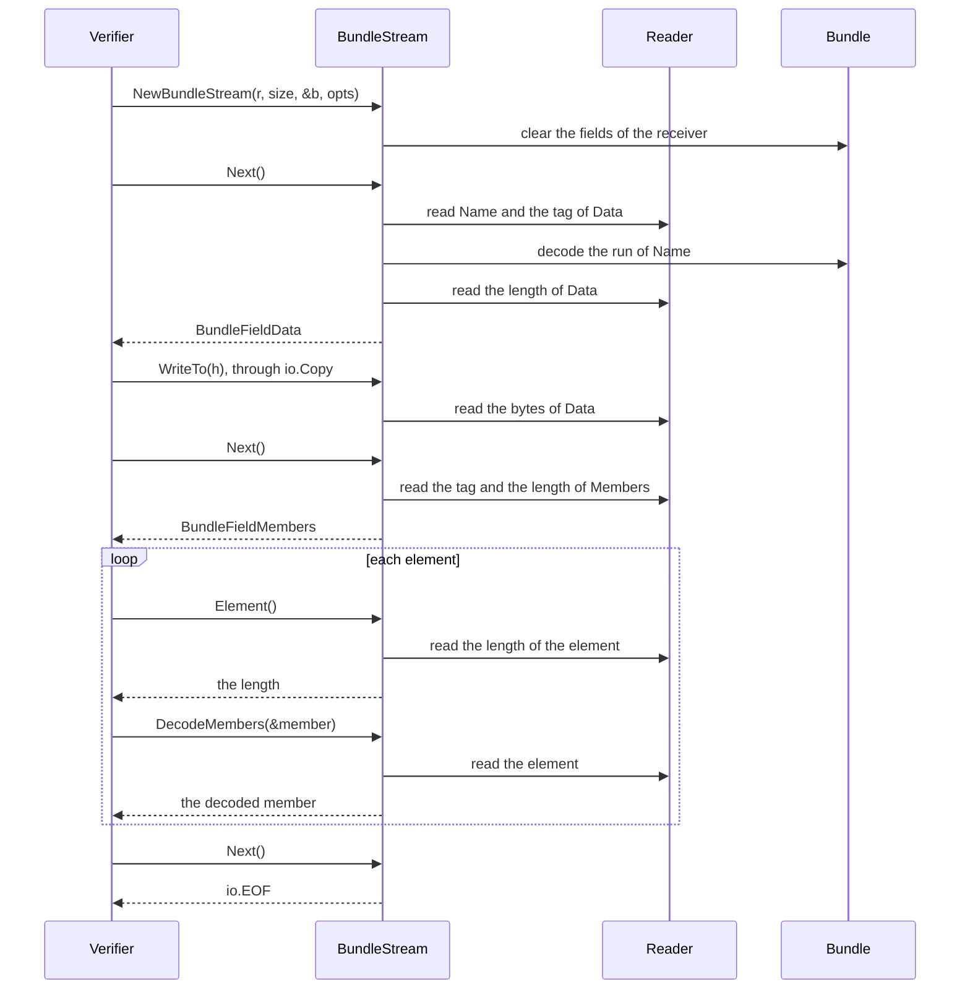

# RFC-0007: Decoding a message from a stream, one field at a time

## Summary

A struct field with the tag option `stream` makes the generator write a stream decoder for its
struct type. The stream decoder of a type `T`, `TStream`, reads the encoding of a `T` from an
`io.Reader` in input order, and the caller gives the length of the encoding. Every field without
the option decodes into a `*T` with the code of `DecodeKanon`. The decoder stops at each field
with the option and passes its value to the caller: the bytes of a byte slice or a string
through `Read` or `WriteTo`, and the elements of a slice of structs one at a time through
`Element` and a decode method per field. It returns the declared length of each value and of each element before
it reads them. For an encoding within its buffer limit, it accepts exactly the encodings that
`DecodeKanon` accepts, and it returns the error of `DecodeKanon` at the same offset. Its memory
depends on its buffer limit and not on the length of the encoding.

## Motivation

The generated decode reads one `[]byte` that contains the whole encoding. `DecodeKanon`,
`MergeKanon` and `UnmarshalBinary` take one. So do the functions of `kanon/wire` that the
generated code calls. The frame reader reads a whole frame into its buffer before it decodes it.
By default it refuses a frame above 16 MiB. A decode of a message with a large byte slice needs
the whole encoding in memory and the decoded value besides.

Core's signature type has a byte slice `Value`. kanon generates its codec with `-canonical`. One
decode of a signature allocates these bytes, measured on 2026-10-08 with Go 1.27.1:

| `Value` | Encoding | `UnmarshalBinary` | `DecodeKanon` with the encoding as the slab | The same decode into a receiver that decoded before |
|---|---:|---:|---:|---:|
| 1 MiB | 1,048,607 B | 2,105,344 B | 1,048,576 B | 0 B |
| 64 MiB | 67,108,896 B | 134,225,952 B | 67,108,992 B | 0 B |

`UnmarshalBinary` copies its input once as the slab of the decoded strings, so it allocates
about twice the length of the value. A decode with a slab allocates the value once. A decode
into a receiver with room does not allocate. Each form needs the encoding and the value in
memory.

The ledger stores content objects of up to 4 GiB in chunks of 64 KiB. Its audit verifier reads
an object from the store chunk by chunk. The audit field of an entry is an object that encodes a
struct of two byte slices: the actor and the reason. The verifier hashes both. The causal set of
an entry is an object that encodes a struct with a slice of up to thousands of members. The
verifier refuses a member above 324 bytes before it decodes the member: the encoding of an
origin of 255 bytes and a digest of 64 bytes, with their tags and lengths. A whole decode of an
audit object of 4 GiB needs 8 GiB of memory.

The decoder belongs in kanon. The canonical decode applies its rules with the schema in hand, at
the byte that each rule concerns. A parser in the verifier over the functions of `kanon/wire`
would restate those rules outside kanon. Every rule that it restates imperfectly is a parser
differential, the defect that canonical decoding removes. Only the generator knows the schema
of a type and the decode functions of its fields.

Go's standard library reads containers of large entries in the same way. `archive/tar` and
`mime/multipart` return the header of each entry first. `Read` then returns the bytes of the
entry. `encoding/json/jsontext` reads tokens from a reader. `json.UnmarshalDecode` decodes the
next value of such a reader into a Go value. `encoding/gob` reads each message whole before it
decodes it, as the frame reader does.

## Detailed design

### Terms

- A **stream type** is a struct type with at least one field that has the tag option `stream`.
- A **streamed field** is a field with the option. Every other field of a stream type is a
  **decoded field**.
- The **stream** of a stream type `T` is a value of the generated type `TStream`.
- A **run** is a sequence of adjacent decoded fields in the encoding.
- The **current field** is the streamed field that `Next` returned last.

### Components

| Component | Change |
|---|---|
| The generator | The tag option `stream`. For each stream type `T`, the type `TField` with a constant per streamed field, and the type `TStream` with `NewTStream`, `Reset`, `Next` and `Len`, `Read` and `WriteTo` when a byte slice or a string streams, and `Element` and a decode method per streamed slice when a slice streams. The test file of `T` adapts `TStream` to `kanontest.Stream`. The generation fails for the option on the fields that the tag option section lists |
| `kanon` | `StreamOptions`, `DefaultBuffer`, `ErrLimit`, `ErrStreamSize`, one sentence in the documentation of `DecodeError.Offset`, and a `MaxVersion` of 3 |
| `kanon/wire` | `Stream`, the state that every stream decoder shares, with `StreamSchema`, `StreamField` and `Run`, and the function `LimitError` |
| `kanontest` | `Field.Stream`, `Spec.Stream`, the interface `Stream` and the stream checks |
| `Message`, `Options`, the generated encode and decode, views, indexes, `frame`, `batch` and `kanon inspect` | No change |

### Invariants

For an encoding `enc` of `size` bytes, a reader that returns `enc`, and a stream whose
`StreamOptions` have the depth `d` and the buffer limit `b`:

1. **Acceptance.** For an encoding whose bytes outside the streamed fields take at most `b`
   bytes together, and whose elements take at most `b` bytes each, `Next` returns `io.EOF`
   exactly when `DecodeKanon(enc, kanon.Options{Depth: d})` returns nil.
2. **Errors.** For such an encoding that `DecodeKanon` rejects, the first error of the stream is
   the error of `DecodeKanon`, with the same type, field, number, offset, detail and cause. The
   offset counts from the first byte of the encoding.
3. **Limit.** For any other encoding, the stream fails at or before the first field or element
   whose bytes take it past `b`. Its first error is the error of `DecodeKanon` for an input that
   `DecodeKanon` rejects before that field or element, or at its tag or its length in a check
   that precedes the limit. Otherwise its first error wraps `kanon.ErrLimit`, at the tag of the
   field or the length of the element.
4. **Value.** After `io.EOF`, the receiver is the value that `DecodeKanon` decodes, except that
   every streamed field is empty. For a byte slice or a string, the bytes that `Read` returns for
   the last occurrence of the field are its value. For a slice, the elements that its decode
   method decodes, over every occurrence of the field, are its elements in order.
5. **Length first.** The stream returns the declared length of each streamed value and of each
   element before it reads the value. It allocates nothing for a declared length before it has
   checked the length against the rest of the encoding and against `b`.
6. **Bounded memory.** The stream has at most `b` bytes of decoded fields in memory, and at most
   20 bytes more of one field that the decode rejects. It also has one element of at most `b`
   bytes and a read buffer of 4,096 bytes, whatever `size` is.
7. **Bounded reading.** The stream reads at most `size` bytes from the reader.
8. **No result before the end.** Before `Next` returns `io.EOF`, the stream has not checked the
   rest of the encoding. A caller acts on the bytes and the elements that it read only after
   `Next` returns `io.EOF`.

The invariants apply to a caller that reads, decodes or skips each streamed value. The stream
decodes every element that the caller skips, so that the checks of the element run.

### The tag option

```go
//go:generate go tool kanon -type=Bundle,Inner -canonical

// Bundle is a name, a payload and a set of members.
type Bundle struct {
	Name    string
	Data    []byte  `kanon:",stream"`
	Members []Inner `kanon:",stream"`
}
```

The option makes `Data` and `Members` streamed fields of `Bundle`. It changes neither the
encoding, nor the field numbers, nor the generated encode and decode of `Bundle`. `DecodeKanon`
decodes `Data` and `Members` as it decodes any other field.

The generator accepts the option on an exported field of a struct type that a `-type` flag
names, when the type of the field is one of these:

- `[]byte` or `string`, or a named type whose underlying type is one of them
- a slice of a struct type that the decode of the struct decodes through a codec of its own,
  generated or written by hand

The generation fails for the option on any other field: a field of another type, an unexported
field, a member of a union, the field that keeps unknown fields, and a field of an inline
struct. It fails for a type that encodes itself and for a `kanon.Validator` whose directive has
`-validate`. It also fails when the package declares a name that the code of the stream
declares.

These kinds decode whole:

- An element of a `[]*E` has a presence byte, so a nil element would need a third result from
  `Element` and from the decode method. A consumer that streams a large slice of pointers would
  reverse this verdict.
- A map, an array, a time, an interface and a nested struct decode whole into the receiver. A
  consumer whose large value is in a map or a nested struct would reverse this verdict.
- A union member decodes whole, since a member replaces its union and sets its discriminator.
- A `kanon.Validator` with `-validate` and a type that encodes itself decode whole, since their
  checks read the whole value.
- The field that keeps unknown fields decodes whole, since the decode appends every unknown
  field to it.

### The generated code

The generator writes these declarations for `Bundle`, and an unexported variable of the type
`wire.StreamSchema` that describes `Bundle` to its `wire.Stream`:

```go
// BundleField names a streamed field of Bundle, which BundleStream.Next
// returns. Its value is the field number.
type BundleField int

// The streamed fields of Bundle.
const (
	BundleFieldData    BundleField = 2
	BundleFieldMembers BundleField = 3
)

// BundleStream decodes the encoding of a Bundle from a reader, one field at a
// time, in input order. It decodes each field without the tag option stream
// into the receiver that NewBundleStream takes, with the code of DecodeKanon,
// and stops at each field with the option: Read returns the bytes of Data and
// WriteTo writes them to a writer, and DecodeMembers decodes the elements of
// Members. Once Next returns io.EOF, the receiver contains the value of the
// encoding, with Data and Members empty.
//
// # Checks
//
// The stream applies the checks of DecodeKanon to every byte, in the order of
// DecodeKanon, and returns the error that DecodeKanon returns for the same
// encoding: a *kanon.DecodeError whose Offset counts from the first byte of the
// encoding. It passes a streamed value to the caller before it has read the
// rest of the encoding, so an error can follow the bytes and the elements that
// the caller has read. A caller uses them only after Next returns io.EOF.
//
// # Limits
//
// The stream has in memory the decoded fields of the encoding together, one
// element, and a read buffer of 4096 bytes. A decoded field that would take the
// decoded fields past the Buffer of its kanon.StreamOptions, and an element
// longer than that Buffer, fail with a *kanon.DecodeError that wraps
// kanon.ErrLimit. A reader that returns fewer than size bytes fails the call
// that needs the next byte with a *kanon.DecodeError that wraps
// io.ErrUnexpectedEOF, at the offset of that byte. The methods return any other
// error of the reader unchanged, and io.ErrNoProgress when the reader returns
// no byte and no error 100 times before the bytes that a call needs. After an
// error, every method returns that error.
//
// # Aliasing
//
// The strings of the receiver are substrings of the buffer of the decoded
// fields until the next call of Reset. The strings of an element are substrings
// of the buffers of the stream until the next call of Next, Element or a decode
// method. A caller that needs a value after that copies it with CloneKanon.
//
// # Allocation contract
//
// NewBundleStream allocates the stream and its read buffer of 4096 bytes. Next
// and the decode methods allocate nothing once the buffers of the stream have
// grown to the decoded fields and to the longest element of more than 4096
// bytes, except where DecodeKanon allocates for the same values. Reset, Len,
// Read and Element do not allocate, and WriteTo allocates only what its writer
// allocates.
//
// # Concurrency
//
// A BundleStream is not safe for concurrent use. It writes the receiver until
// Next returns io.EOF or an error, so no other goroutine reads the receiver
// before then.
type BundleStream struct {
	// unexported fields
}

// NewBundleStream returns a BundleStream that reads the encoding of a Bundle,
// size bytes, from r and decodes it into m, which Reset prepares as it states.
// opts sets the nesting limit and the buffer limit of the stream.
func NewBundleStream(r io.Reader, size int64, m *Bundle, opts kanon.StreamOptions) *BundleStream

// Reset makes d read the encoding of a Bundle, size bytes, from r into m, and
// reuses the buffers of d. It clears the fields of m that the encoding leaves
// out, and the fields that the decode does not track, the streamed fields among
// them, as DecodeKanon clears them. It reads at most size bytes from r. A size
// below 0, or above math.MaxInt, makes the first call of Next fail with
// kanon.ErrStreamSize. The strings that d decoded before are substrings of the
// buffers that it reuses.
func (d *BundleStream) Reset(r io.Reader, size int64, m *Bundle)

// Next moves to the next streamed field of the encoding and returns it. It
// first moves past the rest of the current field: it discards the unread bytes
// of a byte slice or a string, and decodes the unread elements of a slice into
// an element of its own, so that their checks run. It then decodes the fields
// before the next streamed field into the receiver, and checks the tag and the
// length of the streamed field as DecodeKanon checks them. At the end of the
// encoding it finishes the decode of the receiver as DecodeKanon finishes it,
// and returns io.EOF.
func (d *BundleStream) Next() (BundleField, error)

// Len returns the declared length in bytes of the value of the current field,
// and 0 before the first call of Next and after Next returns io.EOF or an
// error.
func (d *BundleStream) Len() int64

// Read reads the next bytes of the value of the current field into p, when the
// current field is Data: at most len(p) bytes, and at most the bytes that
// remain of the value. It returns io.EOF when no byte of the value remains, and
// when the current field is another field.
func (d *BundleStream) Read(p []byte) (int, error)

// WriteTo writes the rest of the value of the current field to w, when the
// current field is Data, and returns the number of bytes that w took. io.Copy
// from d calls it, so it allocates nothing. It writes nothing, and returns 0
// and nil, when no byte of the value remains and when the current field is
// another field. It returns the error of w, io.ErrShortWrite when w takes fewer
// bytes than it passes without an error, and the errors of the reader that Read
// returns.
func (d *BundleStream) WriteTo(w io.Writer) (int64, error)

// Element reads the length of the next element of the current field, when the
// current field is Members, and returns it without reading the element. It
// returns the same length until a decode method decodes the element. It checks
// the length as DecodeKanon checks it, and returns io.EOF after the last
// element and when the current field is another field.
func (d *BundleStream) Element() (int64, error)

// DecodeMembers decodes the next element of Members into e, when Members is the
// current field, with the code that DecodeKanon runs for an element of Members,
// at the same depth. It reads the length of the element first when Element has
// not read it. It returns io.EOF after the last element, and when the current
// field is another field. The strings of e are substrings of the buffers of d
// until the next call of Next, Element or a decode method.
func (d *BundleStream) DecodeMembers(e *Inner) error
```

The `Next` of a type without `-canonical` also states that a streamed field that occurs twice
in the encoding returns twice.

This verifier hashes `Data` and refuses a member above its limit before it decodes the member:

```go
package verify

import (
	"errors"
	"hash"
	"io"

	"go.thesmos.sh/kanon"
)

// maxMember is the most bytes that the encoding of an element of Members
// takes.
const maxMember = 324

// errMemberTooLong is the error of an element of Members above maxMember
// bytes.
var errMemberTooLong = errors.New("verify: member above 324 bytes")

// verify reads the encoding of a Bundle, size bytes, from r. It hashes Data
// into h and passes each member to check. It returns the Bundle with Data and
// Members empty.
func verify(r io.Reader, size int64, h hash.Hash, check func(*Inner) error) (Bundle, error) {
	var b Bundle
	var member Inner
	s := NewBundleStream(r, size, &b, kanon.StreamOptions{})
	for {
		f, err := s.Next()
		if errors.Is(err, io.EOF) {
			return b, nil
		}
		if err != nil {
			return Bundle{}, err
		}
		switch f {
		case BundleFieldData:
			if _, err := io.Copy(h, s); err != nil {
				return Bundle{}, err
			}
		case BundleFieldMembers:
			if err := checkMembers(s, &member, check); err != nil {
				return Bundle{}, err
			}
		}
	}
}

// checkMembers decodes each element of Members into member and passes it to
// check. It refuses an element above maxMember bytes before it decodes the
// element.
func checkMembers(s *BundleStream, member *Inner, check func(*Inner) error) error {
	for {
		n, err := s.Element()
		if errors.Is(err, io.EOF) {
			return nil
		}
		if err != nil {
			return err
		}
		if n > maxMember {
			return errMemberTooLong
		}
		if err := s.DecodeMembers(member); err != nil {
			return err
		}
		if err := check(member); err != nil {
			return err
		}
	}
}
```

The example declares `Bundle`, `Inner` and the generated code in the same package. `io.Copy`
calls the `WriteTo` of the stream, so the copy into the hash allocates nothing.

The caller of `verify` uses the hash of `Data` and the results of `check` only when `verify`
returns nil, since a later byte of the encoding can still fail the decode.

### Reading order



`NewTStream` and `Reset` clear the receiver with the statements that `DecodeKanon` runs before
the fields. The generated `Next` first decodes the elements that the caller skipped. It then
calls `wire.Stream.Next`, which discards the unread bytes of the current field and reads the
encoding in input order. At the tag of a decoded field it starts a run. It appends the field to
its buffer of decoded fields, and reads further fields into the run until the tag of a streamed
field or the end of the encoding. It finds the end of each field from the wire format in its
tag, as the decode skips an unknown field.

The generated code decodes the run into the receiver with the function that `DecodeKanon` calls
for the fields of the struct, at offset 0 of the run. It passes an error of that decode to
`wire.Stream.Fail`, which adds the offset of the run in the encoding to the offset of the error.
For a struct whose decode tracks the fields that it has seen, such as a pointer field, the
function receives that bitmap, so that a field that occurs in two runs merges as it merges in
`DecodeKanon`. The generated code then calls `wire.Stream.Open`, which opens the streamed field
after the run, or returns `io.EOF` at the end of the encoding. After `io.EOF` the generated code
runs the statements that `DecodeKanon` runs after the fields, such as the clearing of the
pointers that the encoding leaves out.

The decode function checks a run as `DecodeKanon` checks the same bytes, except for the two
canonical rules that span runs. The stream applies those two rules itself, with the error
functions of the generated decode:

- The field numbers of a canonical type ascend across runs and streamed fields.
  `wire.Stream.Next` fails at the first tag of a run whose number is not above the streamed
  field before it. The run takes in the tag of a streamed field whose number is not above the
  last field of the run. The decode of the run then rejects it.
- A member of a canonical union follows no member of the same union in an earlier run. The
  stream of a canonical type with a union decodes each run with a method of its own. That method
  keeps a bitmap of the unions whose member an earlier run contains.

Where `DecodeKanon` stops inside a field, `wire.Stream.Next` ends the run after the bytes that
`DecodeKanon` reads before it stops, so that the decode of the run returns the error of
`DecodeKanon` at the same offset:

- A tag that does not read, of field number 0, of the number of a streamed field with another
  wire format, or with an invalid wire format ends the run after the tag. So does a tag of a
  canonical decode that is not in its shortest form or not above the field before it.
- A varint or a length that exceeds 64 bits ends the run after its 10 bytes.
- A length that runs past the end of the encoding ends the run after the length. The decode
  reports the truncation at the offset of the length.
- A field that the encoding ends inside ends the run with the encoding.

These checks precede the buffer limit. A field that passes them, and that would take the decoded
fields past the limit, ends the run before its tag. `Open` returns the error that wraps
`kanon.ErrLimit` after the decode of that run, so that an error of `DecodeKanon` in the run comes
first. A field that fails one of these checks adds at most 20 bytes beyond the limit to the run:
a tag of 10 bytes and a length of 10 bytes.

`Open` reads the length of the streamed field. It returns the error of the decode in these
cases, in this order:

- A length that does not read or that runs past the encoding fails at the offset of the length.
- In a canonical decode, a length longer than its shortest form fails at the same offset.
- A slice under a negative `Depth`, which rejects every nested value, fails at the offset of the
  value.
- In a canonical decode, a value of no bytes, which the encoding leaves out, fails at the offset
  of the tag.

Each element of a streamed slice starts with its length, which `Element` reads. `Element`
returns the error of the decode of the slice for a length that does not read or that runs past
the field, and in a canonical decode for a length longer than its shortest form. The decode
method of the field calls `wire.Stream.Value`, which checks the nesting limit of the element at
the offset of its first byte, and then the length of the element against the buffer limit at the
offset of the length. `Value` returns the element as a `wire.Run`. The decode method decodes it
with the code that the decode of the slice runs for one element, at the same depth. `Next`
decodes each element that the caller skips into an element that the stream has for each
streamed slice.

A type without `-canonical` accepts fields in any order and more than once. `Next` returns each
occurrence of a streamed field. For a byte slice or a string, the last occurrence is the value,
since a later occurrence replaces an earlier one. For a slice, every occurrence adds its
elements, since a later occurrence appends to an earlier one.

### Errors and failure handling

After an error, every method of the stream returns that error again. After the end of the
encoding, `Next` returns `io.EOF` again. An error of the writer of `WriteTo` is no error of the
stream: the stream continues with the bytes that the writer did not take.

| Failure | Method | Error | Offset |
|---|---|---|---|
| Input that `DecodeKanon` rejects | The method that reads the failing byte | The `*kanon.DecodeError` of `DecodeKanon` | The offset that `DecodeKanon` reports |
| A reader that returns fewer than `size` bytes | The method that needs the next byte | A `*kanon.DecodeError` that wraps `io.ErrUnexpectedEOF`, for the struct at a byte of a decoded field or a tag, and for the streamed field at a byte of its value | The offset of that byte |
| An error of the reader other than `io.EOF` | The method that reads | The error of the reader, unchanged | None |
| A reader that returns no byte and no error 100 times before the bytes that a call needs | The method that reads | `io.ErrNoProgress` | None |
| A writer that fails, or that takes fewer bytes than `WriteTo` passes | `WriteTo` | The error of the writer, unchanged, or `io.ErrShortWrite` for a writer that returns no error | None |
| A decoded field that would take the decoded fields past `Buffer` | `Next`, after the decode of the run before the field | A `*kanon.DecodeError` that wraps `kanon.ErrLimit`, for the struct | The tag of the field |
| An element of more than `Buffer` bytes | The decode method of the field, or `Next` for a skipped element | A `*kanon.DecodeError` that wraps `kanon.ErrLimit`, for the streamed field | The length of the element |
| A `size` below 0 or above `math.MaxInt` | Every call of `Next` | `kanon.ErrStreamSize` | None |

`DecodeError.Offset` is an `int`, so the stream refuses a `size` above `math.MaxInt`. On a
platform with a 32-bit `int`, the stream refuses an encoding above 2 GiB.

### Memory and allocations

The stream reads the encoding from an `io.LimitedReader` of `size` bytes, so it asks the reader
for no byte past the encoding. It has three buffers:

- A read buffer of 4,096 bytes, which `NewTStream` allocates. The stream parses the tags, the
  lengths and the values of the decoded fields, and the lengths of the elements, in the read
  buffer.
- The buffer of the decoded fields, which grows to the decoded fields of the encoding together:
  at most `Buffer` bytes, and 20 bytes more of a field that the decode rejects. The stream reuses
  it after `Reset`.
- The buffer of the long element, which grows to the longest element of more than 4,096 bytes,
  at most `Buffer` bytes. An element of up to 4,096 bytes is a slice of the read buffer.

The stream copies the decoded fields that the read buffer contains whole with one copy. It reads
the rest of a value longer than the read buffer into the buffer of the decoded fields or of the
long element directly. `Read` reads into the slice of the caller directly when the read buffer is
empty and the slice has 4,096 bytes or more. `WriteTo` passes the read buffer to its writer, one
read buffer at a time, so `io.Copy` from the stream allocates nothing.

The strings of the receiver are substrings of the buffer of the decoded fields, which is the slab
of their decode. A string of an element is a substring of the read buffer or of the buffer of the
long element. Once the buffers have grown, a stream allocates nothing for the bytes that it
reads, and a decode of a run or of an element allocates what `DecodeKanon` allocates for the same
values with a slab, into a receiver that decoded before.

A `wire.Run` has two fields of four machine words together, the most that the compiler keeps in
registers across the call that returns a struct. `Fail` adds the offset of the run to an error,
and `Open` reports the end of the encoding, so `Run` has no field for either.

### The runtime

```go
package kanon

// DefaultBuffer is the buffer limit of a stream decoder whose [StreamOptions]
// leave Buffer at 0 or less: 16 MiB, the default limit of a frame.
const DefaultBuffer = 16777216

// StreamOptions set the limits of a stream decoder, which the kanon generator
// writes for a struct type with a field that has the tag option stream. The
// zero StreamOptions apply DefaultDepth and DefaultBuffer.
//
// # Concurrency
//
// StreamOptions is a value without references, safe to share.
type StreamOptions struct {
	// Depth is the number of levels that the decode enters below the top
	// struct at most, as the Depth of [Options] sets it. 0 means
	// DefaultDepth, and a negative Depth rejects every nested value.
	Depth int
	// Buffer is the most bytes of the encoding that a stream decoder has in
	// memory for the fields that do not stream, together, and for one
	// element of a streamed slice. A value that would take the decoder past
	// it fails with ErrLimit. 0 or less means DefaultBuffer.
	Buffer int
}

// ErrLimit marks a value that a stream decoder does not read into
// memory: a field that does not stream and that would take the fields
// that do not stream past the Buffer of its [StreamOptions], or an
// element of a streamed slice that is longer than that Buffer.
var ErrLimit = errors.New("kanon: value longer than the buffer of the stream")

// ErrStreamSize is the error of a stream decoder whose size is below 0 or
// above math.MaxInt, the largest offset that a [DecodeError] states. Its
// first call of Next returns it, as it is, and so does every later call.
var ErrStreamSize = errors.New("kanon: stream size outside 0 to math.MaxInt")

// The generator versions that the runtime supports, from MinVersion to
// MaxVersion.
const (
	// MinVersion is the oldest generator version whose files compile
	// against the runtime.
	MinVersion = 1
	// MaxVersion is the newest generator version whose files compile
	// against the runtime.
	MaxVersion = 3
)
```

A stream decoder counts the `Offset` of a `DecodeError` from the first byte of the encoding, as
the docblock of the field states. The docblock of `DecodeError.Err` lists `ErrLimit` among the
causes.

```go
package wire

// StreamField is a field that a stream decoder returns to its caller instead
// of decoding it into its receiver: a byte slice or a string, whose bytes the
// caller reads, or a slice of a struct type with a kanon codec, whose
// elements the caller decodes one at a time.
type StreamField struct {
	// Tag is the tag of the field: its number shifted left by three bits,
	// with the wire format Bytes in the low bits.
	Tag uint64
	// Loc is the location of the field in errors: "Type.Field".
	Loc string
	// Elem names the struct type of the elements of a slice, as the errors of
	// the decode of the slice name it, and is empty for a byte slice and a
	// string.
	Elem string
}

// StreamSchema describes the struct type of a stream decoder to a [Stream]:
// its location in errors, the rules of its decode, and its streamed fields.
// The generated code of the type declares it once, as a package variable.
type StreamSchema struct {
	// Loc names the struct type in errors.
	Loc string
	// Canonical reports that the decode of the type accepts only the
	// canonical encoding of a value.
	Canonical bool
	// Fields lists the streamed fields of the type.
	Fields []StreamField
}

// Run is a part of an encoding that the generated code of a stream decoder
// decodes with one call: a run of the fields that it decodes into its
// receiver, which [Stream.Next] returns, or an element of a streamed slice,
// which [Stream.Value] returns. The generated code decodes Data with the
// slab that [Run.Slab] returns, at offset 0 of the slab, and passes an error
// of the decode to [Stream.Fail], which locates it in the encoding.
//
// A Run takes four machine words, so the compiler keeps a Run that a call
// returns in registers.
type Run struct {
	// Data is the run.
	Data []byte
	// Depth is the number of levels that the decode of the run enters at
	// most: the levels below the struct type for a run of fields, and below
	// the struct of an element for an element.
	Depth int
}

// Slab returns the bytes of Data as a string that aliases them, the slab of
// the decode of the run, so that the decoded strings are substrings of Data
// and the decode copies nothing for them. The strings are valid as long as
// the bytes of Data: until the next Reset for a run of fields, and until the
// next call of Next, Element or Value for an element.
func (r Run) Slab() string

// Stream is the state that the stream decoders of the kanon generator share:
// the reader of an encoding of a known length, the read buffer, the buffer
// of the decoded fields, the buffer of a long element, the streamed field
// that the caller reads, and the first error.
//
// The generated code of a struct type calls [Stream.Init] once, and
// [Stream.Reset] for each encoding. It then calls [Stream.Next], decodes the
// [Run] that Next returns, passes an error of the decode to [Stream.Fail],
// and calls [Stream.Open], which opens the streamed field after the run or
// ends the encoding. The caller of the generated code reads the value of the
// field that Open opened through [Stream.Read] or [Stream.WriteTo], or
// through [Stream.Element] and [Stream.Value], whose element the generated
// code decodes. [Stream.More] reports an element that the caller left
// unread, which the generated code decodes before it calls Next.
//
// # Reading
//
// A Stream reads the encoding from an io.LimitedReader of the length of the
// encoding, so it reads no byte past the encoding, into a read buffer of
// 4096 bytes. It parses the tags, the lengths and the values of the decoded
// fields, and the lengths of the elements, in the read buffer. It finds the
// end of each decoded field from the wire format of its tag, as the decode
// of an unknown field skips it, and copies the decoded fields that the read
// buffer contains whole with one copy. It reads the rest of a value longer
// than the read buffer into the destination of the value. WriteTo writes the
// value of a byte slice or a string to its writer from the read buffer, one
// read buffer at a time. A Stream checks a declared length against the rest
// of the encoding, and the length of an element against the rest of its
// field, before it reads the value or allocates for it.
//
// # Limits
//
// The buffer of the decoded fields grows to the decoded fields of the
// encoding together, with at most 20 bytes more of one field that the
// decode of the type rejects. A field that would take the decoded fields
// past the buffer limit of the stream fails with kanon.ErrLimit at its tag,
// once the decode of the run before the field succeeds. An element longer
// than the buffer limit fails with kanon.ErrLimit at its length, after the
// checks of the decode of the slice that precede the decode of the element.
// An element of up to 4096 bytes is a slice of the read buffer, and a longer
// one is in the buffer of the long element, which grows to the longest
// element.
//
// # Errors
//
// A reader that ends before the length of the encoding fails the call that
// needs the next byte with a *kanon.DecodeError that wraps
// io.ErrUnexpectedEOF at the offset of that byte. The error locates a byte
// of a decoded field or of a tag at the struct type, and a byte of a
// streamed value at the streamed field. A method returns any other error of
// the reader unchanged, and io.ErrNoProgress when 100 calls of the reader
// return no byte and no error before the bytes that one read needs. The
// checks of a length and of a tag return the errors that the decode of the
// type returns for the same encoding, at the same offsets. After an error
// every method returns that error again. After the end of the encoding every
// method returns io.EOF, and WriteTo returns nil. WriteTo returns an error
// of its writer unchanged, and the error does not become the error of the
// Stream.
//
// # Allocation contract
//
// The first Reset allocates the read buffer. Next and Value append to the
// buffer of the decoded fields and to the buffer of the long element, which
// grow to the decoded fields of an encoding and to its longest element of
// more than 4096 bytes, and allocate nothing once they have. Reset, Open,
// Read, Element, More, Len and Fail do not allocate, and WriteTo allocates
// only what its writer allocates. Errors allocate.
//
// # Concurrency
//
// A Stream is not safe for concurrent use.
type Stream struct {
	// unexported fields
}

// Init sets the schema of s, which describes the struct type that s decodes,
// and the limits of opts. The constructor of a generated stream decoder calls
// it once, before the first Reset. A Buffer of 0 or less selects
// kanon.DefaultBuffer, and the Depth selects the nesting limit that
// kanon.Options.Limit returns for it.
func (s *Stream) Init(schema *StreamSchema, opts kanon.StreamOptions)

// Reset makes s read the encoding of size bytes from r, from its first byte,
// and keeps the buffers of s for it. A size below 0, or above math.MaxInt,
// the largest offset that a kanon.DecodeError states, makes every later call
// fail with kanon.ErrStreamSize.
func (s *Stream) Reset(r io.Reader, size int64)

// Next moves past the rest of the current field, a byte slice or a string,
// by discarding the bytes that the caller has not read. The generated code
// decodes the elements of a slice that the caller has not decoded before it
// calls Next. Next then appends the decoded fields after the current field
// to the buffer of the decoded fields, up to the tag of the next streamed
// field or the end of the encoding, and returns them as a [Run].
//
// Next stops at a field that the decode of the type rejects, so that the
// decode of the run returns its error: after a tag that does not read, of
// field number 0, or of the number of a streamed field without its tag, and
// after a value that does not end within the encoding or whose tag has an
// invalid wire format. In a canonical decode it also stops after a tag that
// is not in its shortest form or not above the field before it. Such a tag
// at the start of a run, after a streamed field whose number is not below
// it, fails Next itself, since the decode of the run does not know the
// streamed field before it.
func (s *Stream) Next() (Run, error)

// Open opens the streamed field after the last run, which [Stream.Next]
// found, and returns its number. The generated code calls it after the
// decode of the run succeeds. It reads the length of the field, and returns
// the error of the decode of the type in these cases, in this order:
//
//   - A length that does not read or that runs past the encoding fails at
//     the offset of the length.
//   - In a canonical decode, a length longer than its shortest form fails at
//     the same offset.
//   - A slice under a negative Depth, which rejects every nested value,
//     fails at the offset of the value.
//   - In a canonical decode, a value of no bytes, which the encoding leaves
//     out, fails at the offset of the tag.
//
// After a run without a streamed field, Open returns the error of the field
// after the run that takes the decoded fields past the buffer limit, and
// otherwise io.EOF at the end of the encoding. Every later call returns the
// same error.
func (s *Stream) Open() (int, error)

// Fail records err, the error of the decode of the last run or element that
// Next or Value returned, as the error of s, which every later call returns,
// and returns it. The decode reads the run or the element at offset 0 of its
// slab, so Fail adds the offset of the run or the element in the encoding to
// the Offset of the first *kanon.DecodeError in the chain of err. It returns
// an error without a DecodeError unchanged.
func (s *Stream) Fail(err error) error

// More reports whether the current field is the streamed slice with the
// number num and has an element that Value has not read.
func (s *Stream) More(num int) bool

// Len returns the declared length in bytes of the value of the current
// field, and 0 before the first call of Next and after an error or the end
// of the encoding.
func (s *Stream) Len() int64

// Read reads the next bytes of the value of the current field, a byte slice
// or a string, into p: at most len(p) bytes, and at most the bytes that
// remain of the value. It copies the bytes that the read buffer contains,
// and reads a p of 4096 bytes or more from the reader itself when the read
// buffer is empty. It returns io.EOF when no byte of the value remains, and
// when the current field is a slice. It returns 0 and no error for an empty
// p.
func (s *Stream) Read(p []byte) (int, error)

// WriteTo writes the rest of the value of the current field, a byte slice or
// a string, to w. It returns the number of bytes that w took. WriteTo writes
// the bytes that the read buffer contains, then refills the read buffer from
// the reader and writes again until the value ends. io.Copy from s therefore
// allocates nothing. WriteTo writes nothing and returns 0 and nil when no byte
// of the value remains, when the current field is a slice, and after the end
// of the encoding.
//
// It returns the error of w, and io.ErrShortWrite when w takes fewer bytes
// than it passes without an error. A count from w below 0 counts as 0. A count
// above the bytes that it passes counts as those bytes. An error of the reader
// becomes the error of s, as in Read.
func (s *Stream) WriteTo(w io.Writer) (int64, error)

// Element reads the length of the next element of the current field, a
// slice, and returns it without reading the element. It returns the same
// length until Value reads the element, and io.EOF after the last element
// and when the current field is a byte slice or a string. It returns the
// error of the decode of the slice for a length that does not read or that
// runs past the field, at the offset of the length, and in a canonical
// decode for a length longer than its shortest form.
func (s *Stream) Element() (int64, error)

// Value reads the next element of the current field, when the current field
// is the streamed slice with the number num, and returns it as a [Run]. It
// reads the length of the element first when Element has not, as Element
// reads it. It checks the nesting limit of the struct of the element, at the
// offset of its first byte, and then the length of the element against the
// buffer limit, at the offset of the length. It returns io.EOF after the last
// element and when the current field is another field. The bytes of the run
// are valid until the next call of Next, Element or Value: a slice of the
// read buffer for an element of up to 4096 bytes, and of the buffer of the
// long element for a longer one.
func (s *Stream) Value(num int) (Run, error)

// LimitError returns the error of a stream decoder for the value at offset
// off that would take the bytes that the decoder has in memory past limit:
// a field that does not stream, which loc names as the struct with num 0,
// or an element of the streamed slice that loc and num name. It wraps
// kanon.ErrLimit.
func LimitError(loc string, num, off, limit int) error
```

### The conformance suite

The test file of a stream type sets the `Stream` of its `Spec` to a function that returns its
stream through an adapter, which the test file declares:

```go
// kanonSpecBundle describes Bundle to the conformance suite.
var kanonSpecBundle = kanontest.Spec[Bundle]{
	Fields: []kanontest.Field{
		{Name: "Name", Number: 1},
		{Name: "Data", Number: 2, Stream: true},
		{Name: "Members", Number: 3, Stream: true},
	},
	Canonical: true,
	Stream: func(r io.Reader, size int64, m *Bundle, opts kanon.StreamOptions) kanontest.Stream[Bundle] {
		return kanonStreamBundle{NewBundleStream(r, size, m, opts)}
	},
}

// kanonStreamBundle adapts a BundleStream to kanontest.Stream.
type kanonStreamBundle struct {
	*BundleStream
}

// Next returns the number of the next streamed field of Bundle.
func (s kanonStreamBundle) Next() (int, error) {
	f, err := s.BundleStream.Next()
	return int(f), err
}

// Decode decodes the next element of the streamed slice of Bundle with the
// number num into e, a pointer to an element.
func (s kanonStreamBundle) Decode(num int, e any) error {
	switch num {
	case 3:
		return s.DecodeMembers(e.(*Inner))
	}
	return io.EOF
}
```

Package `kanontest` gains these declarations:

```go
type Spec[T any] struct {
	// The fields Fields, Structs, Keys, Unknown, View and Canonical do not
	// change.

	// Stream returns the stream decoder of T over the encoding of size bytes
	// in r, into m, with opts, as the test file that kanon generates adapts it
	// to [Stream]. kanon declares a stream decoder for a struct type with a
	// field that has the tag option stream, and Stream is nil for any other
	// type.
	Stream func(r io.Reader, size int64, m *T, opts kanon.StreamOptions) Stream[T]
}

type Field struct {
	// The fields Name, Number, Fixed, Union, Case and Types do not change.

	// Stream reports the tag option stream: the stream decoder of the struct
	// returns the value of the field to its caller instead of decoding it.
	Stream bool
}

// Stream is the stream decoder of the struct type T, which kanon generates
// for a struct type with a field that has the tag option stream, as the test
// file that kanon generates adapts it for the checks. Next returns the
// number of the streamed field in place of its constant. The adapter also
// implements io.Reader and io.WriterTo when T streams a byte slice or a
// string, and Element and Decode when T streams a slice: Decode decodes the
// next element of the streamed slice with the number num into e, a pointer
// to an element.
//
// # Concurrency
//
// A Stream is not safe for concurrent use.
type Stream[T any] interface {
	// Reset makes the stream read the encoding of a T, size bytes, from r
	// into m.
	Reset(r io.Reader, size int64, m *T)
	// Next moves to the next streamed field and returns its number, and
	// io.EOF at the end of the encoding.
	Next() (int, error)
	// Len returns the declared length of the value of the current field.
	Len() int64
}
```

The suite fails a `Spec` with a `Field.Stream` set and a nil `Spec.Stream`, and a `Spec` with a
`Spec.Stream` and no `Field.Stream` set. It also fails a `Spec` that sets `Field.Stream` on a
field whose type does not stream. The stream checks are these:

- **The stream decodes as the reference decode.** On the encoding of every sample, on every
  probe of the decode families and on the inputs of the property, a run reads every streamed
  byte slice and string through `Read`, 512 bytes at a time, and decodes every element through
  the decode methods. It sets each streamed field to the value that the decode sets, and
  compares the receiver and the error with the reference decode, without the slab of the probe.
- **One byte per read.** The same run reads through `testing/iotest.OneByteReader`.
- **WriteTo.** The same run copies each streamed byte slice and string through `WriteTo`.
- **Skipped values.** A run that calls `Next` alone returns the same error, and the receiver of
  the reference decode with every streamed field empty.
- **Lengths.** `Len` returns the length that the encoding of every sample that decodes declares
  for each streamed value, and `Read` returns as many bytes.
- **Short input.** A reader that ends at each offset of the encoding of every sample that
  decodes, except the wide samples and the key sample, fails the stream with
  `io.ErrUnexpectedEOF` at that offset, through `Read` and through `WriteTo`.
- **Limit.** Under the `Buffer` that the encoding of a sample needs, its decoded fields together
  or its longest element, the stream decodes it as the reference decode. Under one byte less it
  fails with `kanon.ErrLimit`.
- **Size.** A negative size fails every call of `Next` with `kanon.ErrStreamSize`.
- **Allocation.** A stream after `Reset`, over an encoding that it read before to its end,
  allocates nothing, for every sample that the allocation checks of `DecodeKanon` measure.

`Bench` measures the stream beside `DecodeKanon`, on the same sample.

### Test vectors

The vectors decode with `Bundle` of the tag option section, and `Inner` `{Label string = 1, Count
int64 = 2}` of the wire format, both canonical. The encoding of `{Name: "b", Data: {1, 2, 3},
Members: {{Label: "a"}, {Count: 1}}}` is 17 bytes:

```text
0a 01 62  12 03 01 02 03  1a 07 03 0a 01 61 02 10 02
```

A stream over it returns these results:

| Call | Result |
|---|---|
| `Next` | `BundleFieldData`, after `Name` decodes into the receiver |
| `Len` | 3 |
| `Read` | `01 02 03`, then `io.EOF` |
| `Next` | `BundleFieldMembers` |
| `Len` | 7 |
| `Element`, `DecodeMembers` | 3, `{Label: "a"}` |
| `Element`, `DecodeMembers` | 2, `{Count: 1}` |
| `Element` | `io.EOF` |
| `Next` | `io.EOF`, with the receiver `{Name: "b"}` |

The stream rejects each of these inputs at the offset given. `Next` returns the error unless the
row names another method:

| Input | Size | Buffer | Failure | Offset |
|---|---:|---:|---|---:|
| The vector, from a reader that returns 10 bytes | 17 | 16 MiB | `Element`: truncation in `Members` | 10 |
| `0a 01 62 12 03 01 02 03 1a 08 03 0a 01 61 02 10 02` | 17 | 16 MiB | the length of `Members` runs past the encoding | 9 |
| `0a 01 62 12 03 01 02 03 1a 07 03 0a 01 61 03 10 02` | 17 | 16 MiB | `Element`: the length of an element runs past the field | 14 |
| `0a 01 62 12 00 1a 07 03 0a 01 61 02 10 02` | 14 | 16 MiB | `Data` at a value that the encoding leaves out | 3 |
| `0a 01 62 1a 07 03 0a 01 61 02 10 02 12 03 01 02 03` | 17 | 16 MiB | field 2 after field 3 | 12 |
| The vector | 17 | 2 | `ErrLimit` for the run of `Name` | 0 |
| `1a 07 03 0a 01 61 02 10 02` | 9 | 2 | `DecodeMembers`: `ErrLimit` for the first element | 2 |

`DecodeKanon` rejects the inputs of rows 2 to 5 with the same error at the same offset. In row 5,
`Next` returns `BundleFieldMembers` before it reads the tag of `Data`, and the caller can read
both elements of `Members` before the error.

### Versions

The code of a stream calls `wire.Stream` and `kanon.StreamOptions`, so generated files declare
generator version 3. A file of version 1 or 2 compiles against the runtime, and a file of
version 3 fails to compile against a runtime whose `MaxVersion` is 2.

### Schema changes

Adding the tag option `stream` to a field, or removing it, changes the generated API of the
struct and nothing else. The encoding, the field numbers and the check of the field numbers
against a revision do not change.

### Cost

- The code of a type without a streamed field does not change, apart from its two version
  constants.
- A stream type gains the type `TField` with one constant per streamed field, an unexported
  schema, and `TStream` with `NewTStream`, `Reset`, `Next` and `Len`, plus `Read` and `WriteTo`
  for a byte slice or a string, plus `Element` and one decode method per streamed slice. A
  canonical type with a union also gains a method that decodes a run. For `Bundle`, that code
  takes 182 lines of the code file and 24 lines of the test file, docblocks included.
- A stream copies each byte of a decoded field twice: from the reader into the read buffer, and
  from the read buffer into the buffer of the decoded fields. The rest of a value longer than the
  read buffer goes from the reader into its buffer with one copy. An element of up to 4,096 bytes
  decodes from the read buffer. A byte of a streamed byte slice or string goes through the read
  buffer, except where `Read` reads it into the slice of the caller directly.
- On one core of an AMD Ryzen 9 9950X3D with Go 1.27.1, a `Bundle` with 1,024 members of 10 or
  11 bytes, an encoding of 12,236 bytes, takes 9.0 µs through the stream, and 6.1 µs through
  `DecodeKanon` with the encoding as the slab, into a receiver that decoded before. A `Bundle`
  with a `Data` of 64 KiB takes 0.67 µs through the stream, read 32 KiB at a time, and 0.61 µs
  through `DecodeKanon`. Neither allocates.
- On the same core, `io.Copy` from a stream copies a `Data` of 64 KiB into a writer without
  `ReadFrom` in 0.59 µs through `WriteTo`, and allocates nothing. `Read` alone, 4 KiB at a time,
  takes 0.53 µs, where `bytes.Reader.Read` over the same bytes takes 0.41 µs.

## Alternatives considered

### Decoding the whole message

The caller reads the object into memory and calls `DecodeKanon` with the object as the slab.

**Why not:** the decode needs the encoding and the value in memory. An audit object of 4 GiB
takes 8 GiB.

### One frame per element

The object becomes a stream of frames: one frame for the fixed fields and one per member or per
chunk of a byte slice, which the frame reader reads one at a time.

**Why not:** it changes the stored format to suit the decoder, and the object stops being one
canonical encoding. The verifier would then need a rule of its own for the order and the count
of the frames. A frame of a byte slice longer than the frame limit still needs the whole frame
in memory.

### A parser in the consumer

The verifier parses the encoding with the functions of `kanon/wire` and decodes each member with
its `DecodeKanon`.

**Why not:** the verifier restates the canonical rules of the struct: field order, presence,
unknown fields and the lengths of the elements. The rules then exist in kanon and in the
verifier, and a difference between the two copies is a parser differential. The functions of
`kanon/wire` also read whole slices.

### A runtime decoder driven by a schema table

The generator writes a table of each struct's fields, and one decoder in the runtime reads every
stream type from its table.

**Why not:** the table is a second description of each type beside its generated decode. The
runtime cannot call the unexported decode functions of a package, so it would decode the decoded
fields itself, which is a second parser of every field kind.

### A decode over a reader for every type

The generator writes one decode that reads from an `io.Reader`, and `DecodeKanon` calls it over
a reader of its slice.

**Why not:** every decode then reads its varints byte by byte through an interface. The
generated decode reads a one-byte varint inline from a slice, because an out-of-line call per
varint costs about 2 ns per field. That cost would apply to every decode of every consumer, for a
capability that one consumer needs.

### Every field of a streaming kind

Every byte slice, string and slice of structs streams, without a tag option.

**Why not:** a short string such as an algorithm name then streams too. Every caller then reads
it through `Read`. The API of a type would grow with the kinds of its fields, not with the fields
that its author marks.

### A method per streamed field, in field order

`TStream` has one method per streamed field, such as `Data()` and `Members()`, which moves to
that field.

**Why not:** a type without `-canonical` accepts its fields in any order and more than once. A
method per field cannot follow that order without a buffer for every streamed field, which
defeats the stream.

### A field number or a pointer as the result of Next

`Next` returns the field number as an `int`, or a pointer into the receiver as an `any`, such as
`&b.Data`, which the caller compares.

**Why not:** a bare number makes every caller write a literal or repeat the numbers line of the
generated file. A comparison of an `any` with a pointer into another value compiles and never
matches. `TField` names each streamed field once, and the compiler checks the names.

### A stream without a length

`NewTStream` takes the reader alone, and the end of the reader ends the encoding.

**Why not:** the stream cannot check a declared length against the rest of the input before it
reads the value, which the wire format requires before an allocation. A short input then shows
only when the reader ends, at another offset than the one that `DecodeKanon` reports. A consumer
without the length of its encoding would reverse this verdict.

### Callbacks per streamed field

The caller registers a function per streamed field, such as an `io.Writer` for `Data` and a
function per element of `Members`, and one call decodes the whole encoding.

**Why not:** the stream then calls the caller, and the caller cannot stop between two values
without an error of its own. Go's readers of containers, `archive/tar`, `mime/multipart` and
`encoding/json/jsontext`, return each entry to the caller instead.

### A run with its offset and an end flag

`wire.Run` also has the offset of the run in the encoding and a flag for the run that ends the
encoding. The generated code adds the offset to the offset of an error itself, and runs the
statements after the fields when the flag is set.

**Why not:** a `Run` of six machine words exceeds the four words that the compiler keeps in
registers. The compiler stores the result of each call of `Value` on the stack and copies it. In
four interleaved rounds, the stream decode of the 1,024 members of the cost section took 15.8 µs
with such a `Run` and 8.9 µs without it.

### Read alone

The stream returns the bytes of a byte slice or a string through `Read` alone. `io.Copy` then
reads them through a buffer of its own.

**Why not:** `io.Copy` allocates a buffer of 32 KiB for each call unless its source has `WriteTo`
or its destination has `ReadFrom`. A `hash.Hash` has no `ReadFrom`. Each copy of a streamed
value into a hash would then allocate 32 KiB. Over a `Data` of 64 KiB, `io.Copy` through `Read`
took 1.89 µs and allocated 32 KiB. Through `WriteTo` it took 0.59 µs and allocated nothing.

## Drawbacks

- The public API of kanon grows by one type, one constant and two errors in `kanon`. It grows by
  four types, twelve methods and one function in `kanon/wire`, and by two fields and one
  interface in `kanontest`.
- Each stream type adds a generated type with a constant per streamed field, and a stream type
  with a constructor and three methods, plus `Read` and `WriteTo`, plus `Element` and a decode
  method per streamed slice: 182 lines for `Bundle`.
- The stream frames fields and elements itself. That framing is a second reader of the
  encoding, and the conformance suite proves it equal to the decode only on the samples, the
  probes, the generated values and the fuzz inputs that it runs.
- A stream decode of 1,024 elements of about 10 bytes takes 47% longer than `DecodeKanon` of the
  same encoding from memory.
- A caller can read a streamed value of an encoding that the decode later rejects. The stream
  states the rule, and no type enforces it.
- The strings of the receiver and of an element alias the buffers of the stream.
- The guarantee of the stream covers encodings within its buffer limit. Beyond the limit, it
  fails where `DecodeKanon` succeeds.
- On a platform with a 32-bit `int`, the stream refuses an encoding above 2 GiB.
- The tag option `stream` does not change the encoding, unlike the other tag options, which set
  the encoding of their fields.
- A file of generator version 3 needs a runtime with a `MaxVersion` of 3.
- Views and indexes do not read from a reader.

## Unresolved and future work

- A stream encoder, for a writer that cannot have the value in memory, is not proposed here.
- A frame whose payload streams through the frame reader is not proposed here.
- Elements of a slice of pointers, maps and nested structs do not stream.

## References

| What | Where |
|---|---|
| The request, with the ledger's objects and the limit of a member | https://github.com/thesm-os/kanon/issues/4 |
| The measurement of the decodes of core's signature type | a test in a module that requires go.thesmos.sh/core at dd7ed67 and kanon at 001f9c0, posted on the request |
| The measurement of the stream against `DecodeKanon`, and of the `Run` of six words | `BenchmarkDecode` in a module that generates `Bundle` with the kanon command of this design, Go 1.27.1, `-cpu=1`: six runs for the stream against `DecodeKanon`, and four interleaved rounds of three runs for the `Run` of six words |
| `archive/tar.Reader`: `Next` returns a header whose `Size` gives the length of the entry, and `Read` returns `io.EOF` at its end | `go doc archive/tar.Reader`, Go 1.27.1 |
| `mime/multipart.Reader.NextPart`, which returns each part as an `io.Reader` | `go doc mime/multipart.Reader.NextPart`, Go 1.27.1 |
| `encoding/json/jsontext.Decoder` and `json.UnmarshalDecode`, which decode one value of a stream at a time | `go doc encoding/json/jsontext.Decoder` and `go doc encoding/json/v2.UnmarshalDecode`, Go 1.27.1 |
| `encoding/gob`, which reads a count and then the whole message before it decodes it | `src/encoding/gob/decoder.go:82-110`, Go 1.27.1 |
| `testing/iotest.OneByteReader`, the reader of the check of one byte per read | `go doc testing/iotest`, Go 1.27.1 |
| The size of a struct that the compiler keeps in registers: at most four fields and four machine words | `CanSSA` in `src/cmd/compile/internal/ssa/value.go` and `MaxStruct` in `src/cmd/compile/internal/ssa/decompose.go`, Go 1.27.1 |
| `io.Copy`, which uses `WriteTo` or `ReadFrom` and otherwise allocates a buffer of 32 KiB | `copyBuffer` in `src/io/io.go:407-427`, Go 1.27.1 |
| The measurement of `Read`, `WriteTo` and `io.Copy` over a `Data` of 64 KiB | `BenchmarkRead` in a module that requires the kanon module of this design, Go 1.27.1, `-cpu=1`, six runs, and eight runs for `io.Copy` through `WriteTo` against `io.Copy` through `Read` |
